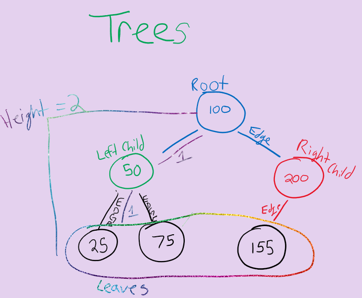
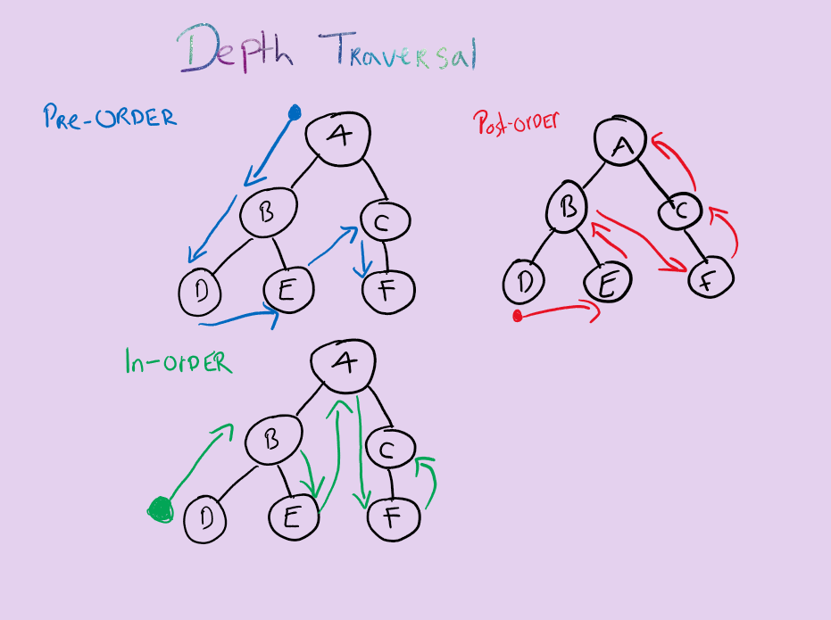

# Trees

### COMMON TERMS
* Node
  - A node is the individual item.data that makes up the data structure.
* Root
  - The root is the first/top Node in the tree
* Left Child
  - the node that is positioned to the left of a root or node
* Right Child
  - the node that is positioned to the right of a root or node.
* Edge 
  - The edge in a tree is the link between a parent and child node
* Leaf
  - A leaf is a node that does not contain any children
* Height
  - The height of a tree is determined by the number of edges from the root to the bottommost node.

### TRAVERSAL

* Moving around the tree
- Traversing a tree allows us t osearch for a node, print out the contents of a tree and more.
* Two categories of traversal:
  - Depth First: Prioritize going through the depth (height) of the tree first. 
  - Pre-order: root >> left >> right
  - In-order left >> root >> right
  Post-order: left >> right >> root

### BIG O

* The Big O time complexity of a Binary Search Tree’s insertion and search operations is O(h), or O(height). In the worst case, we will have to search all the way down to a leaf, which will require searching through as many nodes as the tree is tall. 
* The Big O space complexity of a BST search would be O(1). During a search, we are not allocating any additional space.

### Breadth First

* Breadth first traversal iterates through the tree by going through each level of the tree node-by-node. So, given our starting tree one more time:

* Breadth first travels using a queue (instead of callstack)