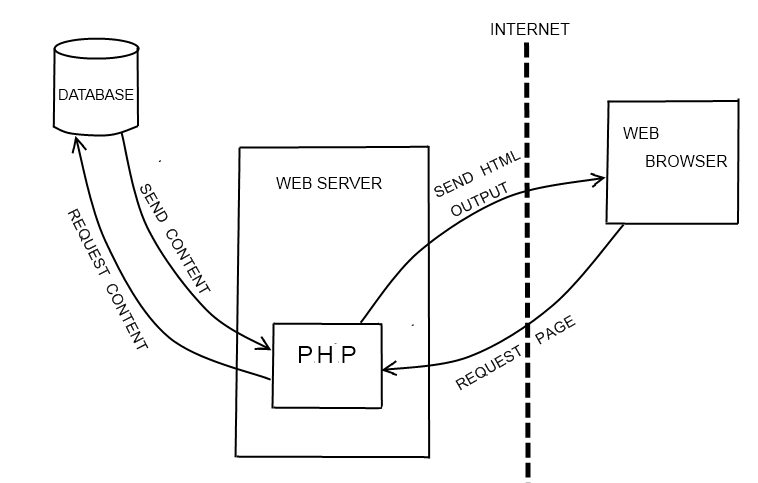

# PHP

- PHP = personal home page

  * PHP is typically used yo generate web page content dynamically.
  * Websites and web applications(server-side scripting)
  * Command line scripting
  * Desktop (GUI) applications

  * PHP can:
    * process and save user from form data.
    * create, open, read, write, delete and close files on the server.
    * restrict access to certain pages of your website, controls user-access
    * add, delete, modify data in databse
    * encrypt data
  


## How does PHP work?

* PHP code is executed on a web server only, not on the local computer. 



* PHP is an interpreted language, when you make changes t o your source code you can immediatley test these changes without first needing to compile your source code into binary form. This makes the development process much faster.

* PHP code is enclosed between the ``` <?php ?> ``` tags and can be embedded into HTML.

## Installation and Use

* Install on terminal with: 
``` sudo apt install php ```

* Run with ```file.php```

## Video Notes

[PHP tutorial](https://www.youtube.com/watch?v=OK_JCtrrv-c)

* PRogramming language that runs on a web server